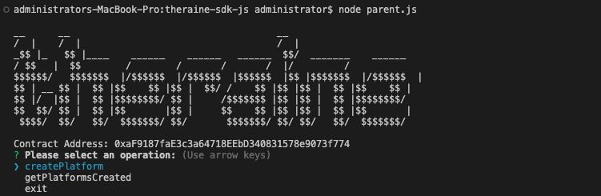
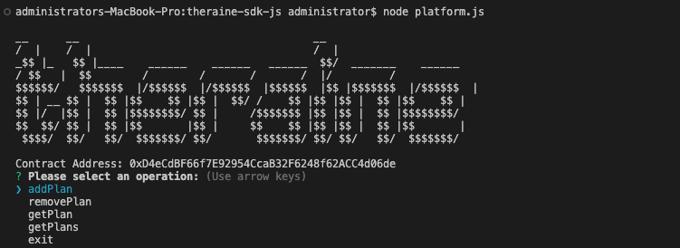

# Theraine SDK js
This is the kit for javascript developers. The kit contains program to interact with theraine-contracts on the Ethereum blockchain.

## Usage
Follow these process to use this kit:

- Clone this repository 
```
git clone https://github.com/Theraine/theraine-sdk-js.git
```

- cd into this repository
```
cd theraine-sdk-js
```

- To create a subscription platform on theraine 
```
node parent.js
```
<p align="center" width="100%">
 
</p> 
Copy contract address created when you select `createPlatform`

- Perform operations on the platform subscription created
```
node platform.js
```
<p align="center" width="100%">
 
</p> 
Select operation to be performed